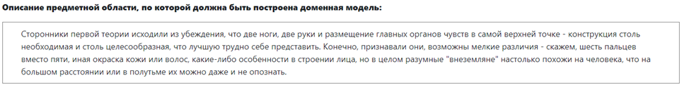
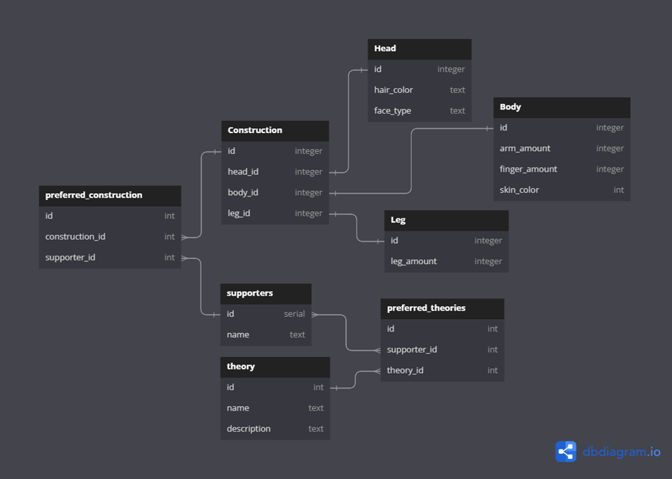
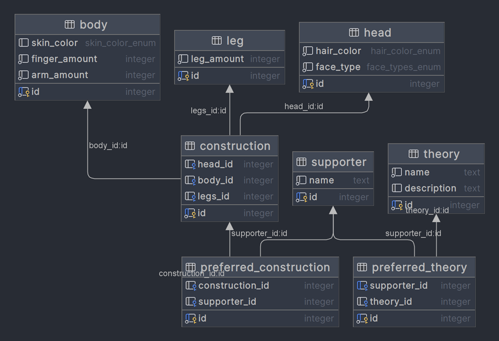

# Задание

Для отношений полученных при построении предметной области из лабораторной работы №1, выполните следующие действия:

- Опишите функциональные зависимости для отношений полученной схемы (минимальное множество);
- Приведите отношения в 3NF (как минимум). Постройте схему на основеNF (как минимум). 
- Опишите изменения в функциональных зависимостях, произошедшие после преобразования в 3NF (как минимум). Постройте схему на основеNF; 
- Преобразуйте отношения в BCNF. Докажите, что полученные отношения представлены в BCNF. Если ваша схема находится уже в BCNF, докажите это; 
- Какие денормализации будут полезны для вашей схемы? Приведите подробное описание.

Придумайте триггер и связанную с ним функцию, относящиеся к вашей предметной области, согласуйте их с преподавателем и реализуйте на языке PL/pgSQL.

<u>Отчёт по лабораторной работе должен содержать:</u>

1. Текст задания.
2. Исходная, нормализованная и денормализованная модели.
3. Ответы на вопросы, представленные в задании.
4. Функция и триггер на языке PL/pgSQL
5. Выводы по работе.

<u>Темы для подготовки к защите лабораторной работы:</u>

1. Нормализация. Формы
2. Функциональные зависимости. Виды
3. Денормализация
4. Язык PL/pgSQL

*Сторонники первой теории исходили из убеждения, что две ноги, две руки и размещение главных органов чувств в самой верхней точке - конструкция столь необходимая и столь целесообразная, что лучшую трудно себе представить. Конечно, признавали они, возможны мелкие различия - скажем, шесть пальцев вместо пяти, иная окраска кожи или волос, какие-либо особенности в строении лица, но в целом разумные "внеземляне" настолько похожи на человека, что на большом расстоянии или в полутьме их можно даже и не опознать.*

Список сущностей
Стержневые:
- head – id, hair_color, face_type;
- body – id, arm_amount, finger_amount, skin_color;
- leg – id, leg_amount;
- theory – id, name, description;
- supporters – id, name;

Ассоциации:
- preferred_construction – id, construction_id, supporter_id

Характеристики:
- preferred_theory – id, supporter_id, theory_id;
- construction – id, head_id, body_id, leg_id;

- Инфологическая модель

Даталогическая модель

