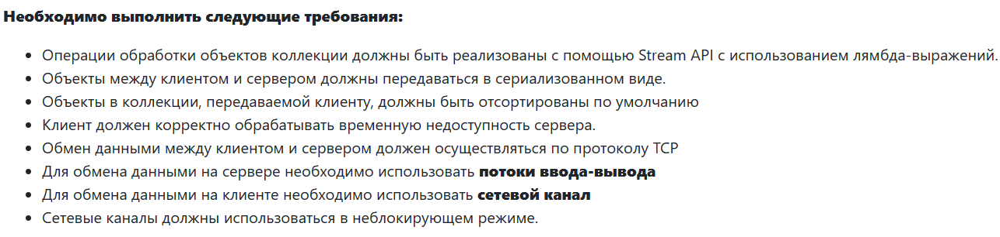

# Лабораторная работа №6, вариант 1894

## Необходимо выполнить следующие требования:

Операции обработки объектов коллекции должны быть реализованы с помощью `Stream API` с использованием лямбда-выражений.

Объекты между клиентом и сервером должны передаваться в сериализованном виде.

Объекты в коллекции, передаваемой клиенту, должны быть отсортированы по умолчанию

Клиент должен корректно обрабатывать временную недоступность сервера.

Обмен данными между клиентом и сервером должен осуществляться по протоколу TCP

Для обмена данными на сервере необходимо использовать **потоки ввода-вывода**

Для обмена данными на клиенте необходимо использовать **сетевой канал**

Сетевые каналы должны использоваться в неблокирующем режиме.

## Обязанности серверного приложения:

Работа с файлом, хранящим коллекцию.

Управление коллекцией объектов.

Назначение автоматически генерируемых полей объектов в коллекции.

Ожидание подключений и запросов от клиента.

Обработка полученных запросов (команд).

Сохранение коллекции в файл при завершении работы приложения.

Сохранение коллекции в файл при исполнении специальной команды, доступной только серверу (клиент такую команду отправить не может).

## Серверное приложение должно состоять из следующих модулей (реализованных в виде одного или нескольких классов):

Модуль приёма подключений.

Модуль чтения запроса.

Модуль обработки полученных команд.

Модуль отправки ответов клиенту.

Сервер должен работать в однопоточном режиме.

## Обязанности клиентского приложения:

Чтение команд из консоли.

Валидация вводимых данных.

Сериализация введённой команды и её аргументов.

Отправка полученной команды и её аргументов на сервер.

Обработка ответа от сервера (вывод результата исполнения команды в консоль).

Команду `save` из клиентского приложения необходимо убрать.

Команда `exit` завершает работу клиентского приложения.

**Важно!** Команды и их аргументы должны представлять из себя объекты классов. Недопустим обмен "простыми" строками. Так, для команды add или её аналога необходимо сформировать объект, содержащий тип команды и объект, который должен храниться в вашей коллекции.

## Дополнительное задание:

Реализовать логирование различных этапов работы сервера (начало работы, получение нового подключения, получение нового запроса, отправка ответа и т.п.) с помощью `Log4J2`

